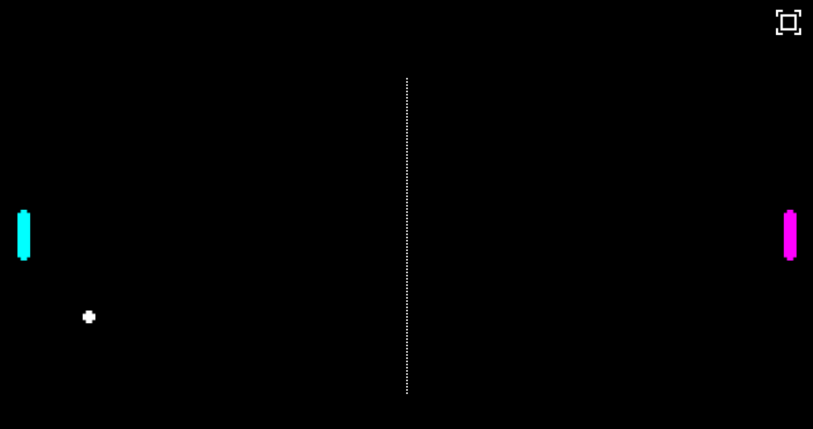

# Classic Ping-Pong game

A classic Ping-Pong HTML5 javascript game based on Phaser.io

## Current features

* __2-players support__: Left player can be controlled by `w` and `s` keys, and right player by `up` and `down` keys.
* __Multi-touch support__: Both players can be controllerd by two fingers on touch screens.
* __Fullscreen support__: Still in beta.

## Todo

* Welcome screen.
* Score count.
* Game-over screen.
* Sound effects.